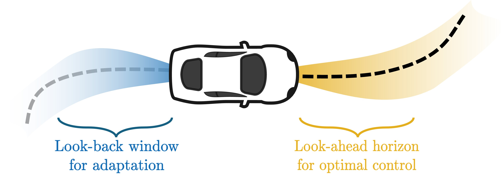

# Look-Back and Look-Ahead Adaptive Model Predictive Control (LLA-MPC)

This repository contains the code for the paper "LLA-MPC: Fast Adaptive Control for Autonomous Racing".

# Summary

## Video Presentation (Coming soon!)

## Numerical Simulations

### Experiment 1

#### ETHZ Track

  
  
  

#### ETHZMobil Track

  
  
  

### Experiment 2

#### ETHZ Track

  
  
  

#### ETHZMobil Track

  
  
  

### Experiment 3

#### ETHZ Track

  
  
  

#### ETHZMobil Track

  
  
  

## CARLA Simulations

# How to run the Code

## LLA-MPC

## APACRace

## Oracle

