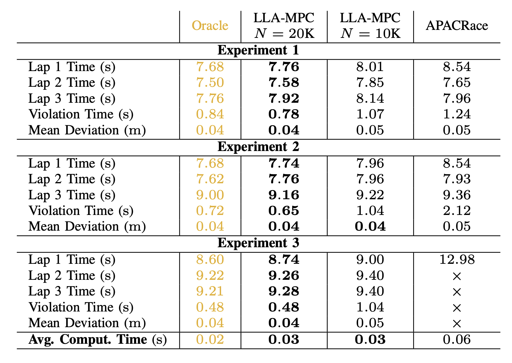
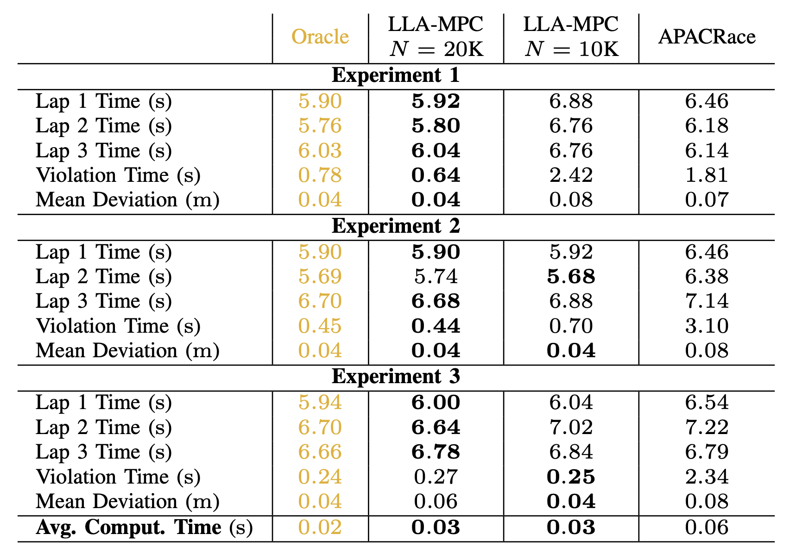

# Look-Back and Look-Ahead Adaptive Model Predictive Control (LLA-MPC)

This repository contains the code for the paper "LLA-MPC: Fast Adaptive Control for Autonomous Racing".

# Summary

## Video Presentation (Coming soon!)

## Numerical Simulations

  <table>
    <tr>
      <!-- Image 1 -->
      <td>
         <!-- Adjust width as needed -->
        

          ETHZ Track
        

      </td>
      <!-- Image 2 -->
      <td>
         <!-- Adjust width as needed -->
        

         ETHZMobil Track
        

      </td>
    </tr>
  </table>

### Experiment 1

#### ETHZ Track

  <table>
    <tr>
      <!-- LLA-MPC -->
      <td>
         <!-- Adjust width as needed -->
        

          LLA-MPC
        

      </td>
      <!-- APACRace -->
      <td>
         <!-- Adjust width as needed -->
        

          APACRace
        

      </td>
      <!-- Oracle -->
      <td>
         <!-- Adjust width as needed -->
        

          Oracle
        

      </td>
    </tr>
  </table>

#### ETHZMobil Track

  <table>
    <tr>
      <!-- LLA-MPC -->
      <td>
         <!-- Adjust width as needed -->
        

          LLA-MPC
        

      </td>
      <!-- APACRace -->
      <td>
         <!-- Adjust width as needed -->
        

          APACRace
        

      </td>
      <!-- Oracle -->
      <td>
         <!-- Adjust width as needed -->
        

          Oracle
        

      </td>
    </tr>
  </table>

### Experiment 2

#### ETHZ Track

  <table>
    <tr>
      <!-- LLA-MPC -->
      <td>
         <!-- Adjust width as needed -->
        

          LLA-MPC
        

      </td>
      <!-- APACRace -->
      <td>
         <!-- Adjust width as needed -->
        

          APACRace
        

      </td>
      <!-- Oracle -->
      <td>
         <!-- Adjust width as needed -->
        

          Oracle
        

      </td>
    </tr>
  </table>

#### ETHZMobil Track

  <table>
    <tr>
      <!-- LLA-MPC -->
      <td>
         <!-- Adjust width as needed -->
        

          LLA-MPC
        

      </td>
      <!-- APACRace -->
      <td>
         <!-- Adjust width as needed -->
        

          APACRace
        

      </td>
      <!-- Oracle -->
      <td>
         <!-- Adjust width as needed -->
        

          Oracle
        

      </td>
    </tr>
  </table>

### Experiment 3

#### ETHZ Track

  <table>
    <tr>
      <!-- LLA-MPC -->
      <td>
         <!-- Adjust width as needed -->
        

          LLA-MPC
        

      </td>
      <!-- APACRace -->
      <td>
         <!-- Adjust width as needed -->
        

          APACRace
        

      </td>
      <!-- Oracle -->
      <td>
         <!-- Adjust width as needed -->
        

          Oracle
        

      </td>
    </tr>
  </table>

#### ETHZMobil Track

  <table>
    <tr>
      <!-- LLA-MPC -->
      <td>
         <!-- Adjust width as needed -->
        

          LLA-MPC
        

      </td>
      <!-- APACRace -->
      <td>
         <!-- Adjust width as needed -->
        

          APACRace
        

      </td>
      <!-- Oracle -->
      <td>
         <!-- Adjust width as needed -->
        

          Oracle
        

      </td>
    </tr>
  </table>

## CARLA Simulations

# How to run the Code

## LLA-MPC

## APACRace

## Oracle

